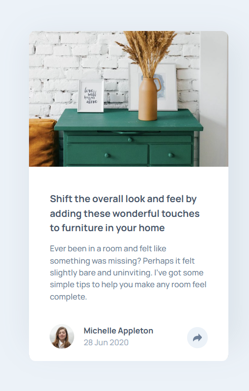
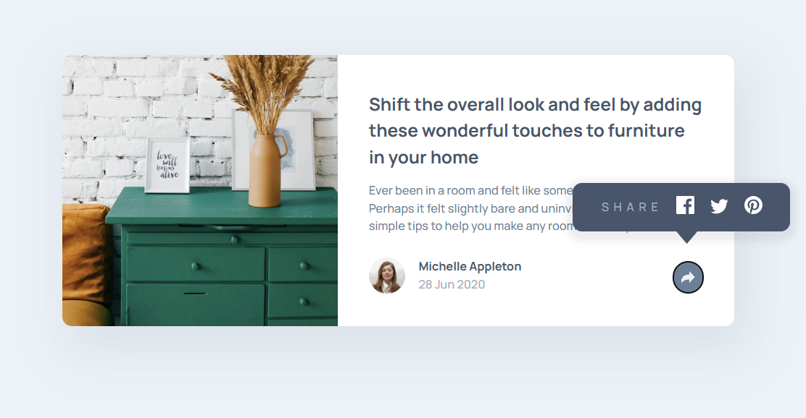

# Frontend Mentor - Article preview component solution

This is a solution to the [Article preview component challenge on Frontend Mentor](https://www.frontendmentor.io/challenges/article-preview-component-dYBN_pYFT). Frontend Mentor challenges help you improve your coding skills by building realistic projects. 

## Table of contents

- [Overview](#overview)
  - [The challenge](#the-challenge)
  - [Screenshot](#screenshot)
  - [Links](#links)
- [Built with](#built-with)
- [Author](#author)

## Overview

### The challenge

Users should be able to:

- View the optimal layout for the component depending on their device's screen size
- See the social media share links when they click the share icon

### Screenshot

Mobile layout

Desktop layout

### Links

- Solution URL: https://www.frontendmentor.io/solutions/responsive-article-preview-component-with-mobile-first-workflow-tTgCU4Yqgd
- Live Site URL: https://may55a.github.io/article_preview_component/

## Built with

- Semantic HTML5 markup
- CSS custom properties
- Flexbox
- Mobile-first workflow

## Author

- Website - https://may55a.github.io/Social-links-profile/
- Frontend Mentor - [@MAY55A](https://www.frontendmentor.io/profile/MAY55A)
- LinkedIn - [@Mayssa Ghanmi](https://www.linkedin.com/in/mayssa-ghanmi-a85369276)
